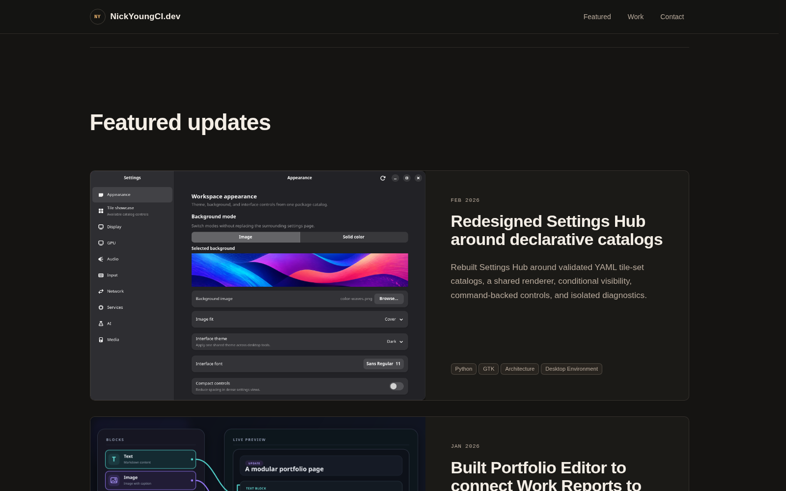
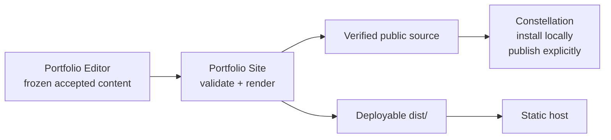

# Portfolio Site

Portfolio Site is the public presentation and build system for portfolio
updates, projects, and capabilities. It turns reviewed, public-only source into a complete
deployable directory with the homepage, detail pages, relationship navigation,
assets, indexes, and sitemap already assembled.

[](docs/images/portfolio-site-featured-updates.png)

*The homepage presents selected work as responsive cards. The same public data
also drives the chronological work view, update detail pages, capability pages,
and derived relationship links.*

## Where it fits



Portfolio Site owns the public contract and deterministic build mechanics.
Portfolio Editor can ask it to render an exact proposed page for review, but the
Site does not read Editor storage, Work Report records, or private notes. Once
built, the website has no server runtime, database, framework, Portfolio
Editor, or Work Report dependency.

The repository owns the public content model, relationship graph, renderers,
homepage, detail pages, generated indexes, and deployment output. Private notes,
source-system identities, review state, absolute paths, and unused evidence are
outside the public source contract.

Its responsibilities are deliberately narrow:

- validate update, project, and capability sources, relationships, assets, privacy
  constraints, and the complete public graph;
- render the same public model used by Portfolio Editor's authoring preview and
  exact review;
- emit allowlisted `public-source` and `dist/` artifacts with reproducible
  identities; and
- remain deployable on an ordinary static host.

It does not decide which evidence belongs in a portfolio, keep private
authoring context, accept an Editor review, or push publication on its own.

## Install and verify

From the repository root:

```bash
npm ci
npm test
./install-user.sh
```

Use **More → Open local site** in Portfolio Editor, or `portfolio-site open`.
The command prepares the latest accepted content, starts the managed local
server, and opens `http://127.0.0.1:9742/`. There is no Site desktop launcher.
`start` performs the same operation without opening the browser; `stop` ends
it immediately. `status --json` exposes the current session, deadline, and
release; `logs` shows the server journal. Editor integration uses the same
`portfolio-site/control@1` command interface.

A session expires **600 seconds after the last qualifying control action**.
Launch, explicit restart/refresh, and a new acceptance or withdrawal during an
active session renew it. Browser interaction, reload checks, health/status
reads, draft saves, reviews, and worker retries do not. Acceptance while stopped
prepares content without starting the server. Delayed acceptance notifications
retain their original timestamp, and duplicate notifications do not renew the
timer. Build completion cannot restart a stopped or expired session.

While running, the newest complete verified release activates automatically.
Open tabs detect the new artifact and reload, preserving their route and scroll
position where possible. A withdrawn page returns to the homepage. A local
notice explains preparation failure or loss of the preview server. Refresh
support is injected once into each full HTML page served locally. Section
fragments remain unchanged. The generated distribution and published pages
contain no injected preview client or notices. The homepage validates each
section's root and shows an error when a section cannot be loaded.

`portfolio-site refresh` requests the latest accepted content and renews an
existing session. With no active session it prepares content without starting
or changing the last installed preview. Background preparation follows the
same rule. `open` can fall back to the last verified release if the Editor is
offline or preparation fails; it reports that the latest content is unavailable.
Closing the browser does not stop the server or extend its deadline.

The server listens on IPv4 port 9742 and serves only verified public artifacts.
The CLI and Editor own lifecycle control; the local server offers no mutating
management API. Its read-only refresh status excludes private failure details.
The complete distribution is held in memory and a new snapshot becomes visible
only after complete verification and a current-session activation. An interrupted
installation leaves the previous complete snapshot usable. Content changes need
no service restart; maintained server-code changes use
`constellation service portfolio-site restart` within an active session.

The Editor owns one durable release dispatcher. The Site controller serializes
builds, reuses immutable page/media/rendering caches, and installs prepared
artifacts through Constellation without compiling twice. Session control has a
separate lock so a slow build cannot block stop or timer renewal. Native
installation residue is retained in private `retired-output/` recovery storage.
Installation records the Node interpreter in
`~/.config/portfolio-site/environment`.

Publication remains explicit through Constellation. It validates the installed
artifact, stages an export, and checks the staged tree against the planned tree
before publication. Later local updates cannot change captured export bytes.
`tests/test_publication_capture.py` checks the installed publisher's concurrent
capture behavior without contacting a remote. No preview command accepts pages
or publishes content.

`npm test` checks public rendering, release preparation, command/session races,
verified server updates, expiry, publication capture, and syntax using disposable
fixtures. Authored content and live acceptance state are not test inputs to mutate.

For the assembled homepage, start the local site and run:

```bash
playwright-cli -s=portfolio-homepage open http://127.0.0.1:9742/
playwright-cli -s=portfolio-homepage run-code --filename=tests/browser_homepage_test.js
playwright-cli -s=portfolio-homepage close
```

This checks startup, manual refresh, unchanged polling, narrow/wide rendering,
and visible failures for malformed section responses. For release-change checks,
`tests/preview_browser_fixture.py serve <temporary-directory> --site-output
<verified-output>` serves a disposable copy of the real site on port 9743.
Its `install <temporary-directory> 2` command activates changed homepage bytes
so an already open tab must reload once and render the sections again.

## Source and generated boundaries

Canonical public sources are:

- `updates/<stable-document-id>/settings.yaml` and the assets referenced by that update;
- `projects/<stable-document-id>/settings.yaml` and referenced project assets;
- `capabilities/<stable-document-id>/settings.yaml` and referenced capability assets;
- independent metadata schemas for all three types and the shared block registry;
- homepage configuration and section source; and
- shared JavaScript, CSS, and static assets.

Generated files include manifests, entity payloads, per-entity asset manifests,
stable detail shells, derived graph relationships, preview dimensions, sitemap
entries, generated block-registry modules, and `dist/`. Do not hand-edit
generated output. Run the build after changing canonical sources.

The build validates the complete public graph rather than one record in
isolation. It rejects malformed or unknown fields, invalid block structures,
duplicate block identities, unsafe or missing assets, missing public image
descriptions, privacy-pattern matches, invalid connections and project cycles. Connections whose
target is outside the exact pool remain authored but unresolved. The deployable directory is allowlisted by
`updates/_public-asset-policy.json` and excludes YAML, databases, logs, private
state, and unreferenced material. `updates/_asset-contract.json` is the shared declarative asset graph for all
three page types, including metadata, nested blocks, attached sources, and
Markdown dependencies. Validation, candidate identity, payload generation, and
distribution copying use the same graph.

The current contracts are update metadata version 10, project metadata version 4,
capability metadata version 7, shared block registry version 9, asset contract
version 2, and shared media contract version 1. Generated payloads are `portfolio-update@9`, `portfolio-project@3`, and
`portfolio-capability@7`, in `update.json`, `project.json`, and `capability.json`.
Every document enters public source through the exact closed-pool boundary.

### Exact page review and site release preparation

Implementation reference: Site 16.0.0 and Editor 27.0.0.

`updates/_page-review.js` accepts `portfolio-site/page-review-input@2`. It pins
current Site mechanics and renders only selected pages against accepted
context, returning `portfolio-site/page-review-result@2` with validation,
connection effects, dependency IDs and exact artifact identity. Working drafts
from other pages never enter this boundary.

`npm run build:release -- --input <request.json> --output <directory>` accepts
`portfolio-site/release-input@2`: an accepted-snapshot@2, immutable content
pointers and a pinned Site renderer. It prepares complete public-source and
dist trees, reusing unchanged page results. The `clean` request flag rebuilds
compiled results as the parity reference. The `portfolio-site/release@2`
receipt binds accepted revision, snapshot, Site source and both output digests
into `release_id`. Operational statistics stay outside the public trees.

`node updates/_release-build.js --verify-output <directory>` verifies both
output trees and release identity. `scripts/stage-prepared-release` copies the
verified artifact into Constellation's native stage; no additional compilation
occurs. `scripts/validate-installed-release` compares the installed result to
the Editor's installed receipt, independently of newer prepared content.

Site never accepts content, reads mutable Editor storage, or publishes on its
own. Editor's [pipeline runbook](https://github.com/Ckrest/portfolio-editor/blob/main/docs/PIPELINE.md)
describes the complete review, acceptance, recovery and release-selection flow.
Old pool-build requests and readers have been removed.

## Public content model

### Updates

An update is a dated account of work. Its required metadata and editor-facing
field help live in `updates/_update-schema.yaml`; block contracts live in
`updates/_block-registry.json`.

- `prominence` controls presentation weight.
- Project membership connects updates and projects to their parent projects.
- Demonstrated capabilities connect updates and projects to capability pages.
- tags are free-form public browsing topics.
- media paths are relative to the update directory.

Every accepted update participates in public indexes and the sitemap. Its
stable document ID is its directory, payload identity, relationship target,
and URL key. Every update has the fixed generated `assets/icon.svg`; an
optional preview is retained regardless of prominence.

The build derives direct project contents, capability evidence, and project links.
Updates and nested projects show the most specific available parent projects in
a notice above the content and again below it. Capabilities remain the final
substantive section. Reference blocks provide other narrative connections.
`updates/_relationship-contract.json` owns endpoint
policy. Connections and reference blocks resolve only when both
pages are in the exact pool; otherwise they are omitted from public derived
data and reported as pending to Portfolio Editor. Rebuilding after a target is
accepted, withdrawn, or reaccepted activates or deactivates both directions
without rewriting the source update. Project membership and capability evidence follow that same optional endpoint policy.

### Projects and capabilities

A project is a current overview of a body of work, with a derived timeline of
its direct updates and child projects. A capability describes an ability, with a derived timeline
of the projects and updates that demonstrate it. Both use the same Editor
blocks, assets, history, preview, and exact acceptance flow as updates.

`public.kind` selects `update`, `project`, or `capability`; omitted kind means
update for existing documents. All three use stable Workspace document IDs.
Metadata belongs to `updates/_update-schema.yaml`,
`projects/_project-schema.yaml`, and `capabilities/_capability-schema.yaml`.
Project and capability `date` means **As of**, the date represented by the
current overview, rather than a new update event.

The relationship contract declares four many-to-many association fields:

| Authored on | Field | Target |
| --- | --- | --- |
| Update or project | `projects` | Parent projects |
| Project | `items` | Direct updates and child projects |
| Update or project | `capabilities` | Capabilities demonstrated |
| Capability | `evidence` | Projects or updates |

Connections live in `data/connections.json` using `portfolio-site/connections@2`,
separate from page YAML. Each typed pair is stored once and the shared
`js/connection-model.js` resolver derives both navigation directions. Editor
can add or remove a connection from either endpoint through that page's draft
proposal. Pending or inactive intent remains in the private accepted ledger;
only connections with both endpoints public are exported. Conversion retains
incompatible connections for possible reactivation. Membership is explicit;
parent projects and tags do not imply additional memberships or capabilities.

`data/documents.json` is the complete typed public catalog; the update index
continues to contain dated updates only. The homepage's **Featured** section can
mix updates, projects, and capabilities using the same responsive cards. Select
their stable document IDs in `site.config.js` under `featured.items`; order is
preserved, unavailable IDs are skipped, and `maxItems` limits the visible cards.
The separate Projects and Capabilities homepage sections and navigation links
are hidden through `disabled`; their detail pages remain available. Detail
timelines use the same entry component as the homepage and order evidence newest
first, with deterministic title and ID ties.

All page types share `updates/_block-registry.json`, its generated module,
`updates/update-renderer.js` block rendering, and `css/document-*.css`. Each owns
its detail template. `projects/page.js` and `capabilities/page.js` own their page
composition and their `page.css` files own type-specific styling. The update
composition remains in `renderUpdate`, with update stylesheet entry points in
`updates/update-base.css` and `updates/update-blocks.css`. Put type-specific
header, footer, and navigation changes in these page-owned files; change the
shared block layer when a change should apply across all three types.

### Public terminology

Internal relationship fields describe graph direction, not interface copy. The
public presentation uses:

- **Capabilities demonstrated** from an update to its capabilities;
- **Demonstrated work** from a capability to supporting projects and updates;
- **Project work** for a project's direct updates and child projects;
- **Part of a larger project** for the parent-project notice; and
- **Explore the projects** for parent-project links below the content.

## Build and runtime architecture

`updates/_build.js` reads all three page types, validates their canonical sources,
derives graph data, and writes a listed manifest, complete accepted catalog,
payloads, detail pages, and sitemap state. `updates/_build-dist.js` assembles only deployable files into
`dist/`. The package scripts are authoritative for the exact build sequence.

The homepage is composed from modules in `sections/`. `site.config.js` owns
section order, enabled sections, featured selection, timeline behavior, and
data-source locations. Runtime sections share the cached JSON loader and mount
without making scroll position a loading or animation state.

All detail pages load their typed payloads and use the shared block renderer
inside their page-owned templates and composition. Relationship navigation is
derived from the built graph. Update cards use prominence-aware shared
components across homepage and relationship contexts without changing the
underlying content.

Mermaid blocks use the pinned Mermaid dependency copied into the Site-owned
vendor directory during the build. Their source is rendered as a diagram in
the browser; a rendering failure is presented as an explicit diagram error.

An omitted update preview is valid; the renderer uses a local placeholder rather
than requesting an assumed asset. When a preview is supplied, its meaningful
alternative text is required.

## Presentation and accessibility contract

Content determines layout transitions. Component CSS owns its responsive
breakpoints; documentation does not duplicate a table of selector-specific
pixel values.

All public layouts must:

- preserve semantic heading order with one page H1 and narrative headings
  beginning at H2;
- keep titles and primary descriptions untruncated and free of manual
  layout-driven line breaks;
- retain content and actions without horizontal page scrolling at 320 CSS
  pixels;
- remain usable at 200% zoom and reflow at 400% zoom;
- tolerate WCAG text-spacing overrides without clipping;
- preserve DOM reading order when visual grids become stacks;
- avoid content-dependent fixed heights and ellipsis for primary content;
- respect reduced-motion preferences; and
- provide a practical interactive target of at least 44 CSS pixels where the
  surrounding layout permits.

Typography is expressed through semantic roles such as page title, page
summary, section title, narrative heading, card title, body, compact body, and
label. Components may adapt a role to their format, but should not invent an
unrelated size or use metadata styling for text required to understand content.

## Authoring boundaries

Portfolio update research, writing, evidence selection, relationships, and
review follow the
[Portfolio Update Workflow](https://github.com/Ckrest/portfolio-editor/blob/main/docs/PORTFOLIO_UPDATE_WORKFLOW.md)
and are applied through Portfolio Editor. The
[Capability Authoring Guide](docs/CAPABILITY_AUTHORING_GUIDE.md) defines
capability claims, evidence selection, source format, and review criteria.

Build failures are reserved for objective contract, safety, privacy, asset,
and graph errors. Automated checks do not grade subjective prose or rewrite
authored content.

## External authoring boundary

The update schema, update block registry, generated browser registry, detail
shell, renderer, and responsive styles form a reusable authoring and preview
surface. Portfolio Editor consumes those Site-owned contracts in two ways: it
injects an in-memory candidate into the detail shell for immediate authoring,
and it invokes the exact Workspace build contract for a durable approval view.
The bridge is an optional authoring integration: it does not belong to the
published DOM, and the Site neither loads nor requires the Editor.

The block registry declares whether each field is visible public meaning or
structural public source. Evidence uses one description visibly and for
assistive technology. Published blocks are strict allowlists: private
provenance fields are invalid in Site settings, while Editor stores concise
internal context outside the public block payload.

Update blocks use one semantic flow and three explicit presentation widths:
`intrinsic` prevents a raster image from being enlarged beyond its source,
`content` follows the reading measure, and `wide` uses the visual canvas.
Image, gallery, comparison, and authored preview links use the locally vendored
PhotoSwipe viewer; source dimensions are generated into the current update
payload so zoom and intrinsic sizing do not depend on layout guesses. Gallery
tiles default to `contain`; cropping requires an explicit `fit: cover` choice.
Detail previews use a consistent 16:9 cover frame, descriptions use a centered
artifact footprint with a small responsive text inset, and Mermaid
diagrams expose a compact keyboard-operable zoom toolbar. Image surfaces do not
add a second border or matte over an asset's own transparent or rounded edges;
PhotoSwipe uses a stable fade into the viewer while retaining in-viewer zoom.
Mermaid blocks use one stable frame, layout-sized zoom content, center-preserving
zoom steps, and an inset scrollport so scrollbars do not collide with the frame.

## Deployment

See [Browser caching and release recovery](docs/BROWSER_CACHING.md) for the
asset contract, 30-day retention policy, Cloudflare configuration, and rollout
checks.

Deploy the generated `dist/` directory to any static host that preserves the
repository's relative paths. `_headers` supplies the intended cache and baseline
security policy for hosts that support that file. `.nojekyll` keeps underscore
assets available when GitHub Pages serves the repository or deployment tree.
This package intentionally contains no update commit, push, or remote
publication wrapper.

Constellation owns Git publication from the installed, verified `public-source`
artifact. Review the exact export and its safety scan before publishing:

```bash
constellation publish portfolio-site --preview
constellation publish portfolio-site --message "Publish reviewed Portfolio pool"
```

The first command is read-only. The second advances the accepted public branch
only if its remote tip, installed artifact, validation results, and export tree
still match that plan. Direct pushes from the Site worktree remain guarded. The
administrative `--replace-history --allow-replacement` combination exists only
for an intentional one-time public-history cutover; routine pool publications
must not use it.


## Explicit media and looping previews

`updates/_media-contract.json` owns media kinds and preparation policy. Preview
values require `kind`, `src`, `description`, `placement`, and `fit`; local video
also requires `poster`. Image blocks and image slots explicitly use `kind:
image`. Local video blocks select `playback: player` or `loop`; provider videos
use Player. Old media shapes are rejected.

The Editor prepares silent MP4/H.264 clips and still posters before review.
Site builds inspect bytes with FFprobe, validate the clip policy, and copy
exact reviewed assets. They never encode video. Generated metadata includes
verified dimensions, duration, MIME/codec, and digest; social images use posters.
Cards, detail previews, and blocks share media rendering and bounded playback.
Loops pause offscreen and in hidden tabs, respect reduced motion, and keep
accessible controls outside navigation links. Authoring rerenders preserve
position and pause state. Image zoom and video inspection have separate viewers.

The local snapshot server supports single byte ranges, suffix ranges, HEAD,
and If-Range, all bound to one verified immutable snapshot. Media source or
poster changes participate in exact review and realization identities.
